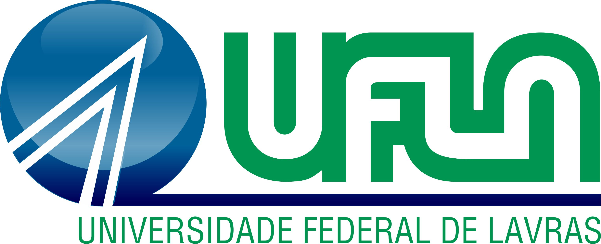

# Anotacoes de aulas  de IAlg 2026/01

#### Gabriel Guimarãe de Almeida

Olá, pessoas!!!

Se você está lendo isso, provavelmente você está cursando algum curso de tecnologia na Universidade
Federal de Lavras (UFLA) e fazendo a disciplina de Introdução a Algoritmos.

Este repositório servirá de local para armazenar as anotações e exemplos que vamos fazer em sala de aula.

A estrutura de arquivos seguira o seguinte padrão:

- Pasta raiz
  - Pasta "/aulas" 
    - Pasta de cada semana (exemplo "semana_01", "semana_02", ...) 
      - Pasta de cada aula da semana (exemplo "aula_1" ou "aula_2" para as aulas de **terça** e **quinta**)
  - Pasta "/documentacao" (pasta para armazenar arquivos para a documentação deste repositório)

Qualquer dúvida, basta contatar-me em sala de aula ou pelo e-mail institucional =]
